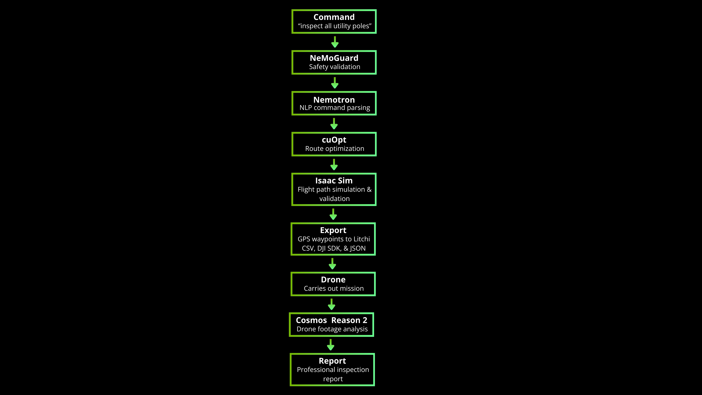

<h1 align="center">PARALLAX</h1>

<h3 align="center">Digital Twin Ground Control — Test Before You Fly</h3>

<p align="center">
  Natural language drone inspection powered by 8 NVIDIA AI technologies.<br/>
  Speak a command. Simulate the mission. Inspect infrastructure. Generate reports.
</p>

<p align="center">
  <a href="#demo-video">Demo Video</a> •
  <a href="#the-problem">The Problem</a> •
  <a href="#how-it-works">How It Works</a> •
  <a href="#nvidia-ai-stack">NVIDIA Stack</a> •
  <a href="#real-world-demo">Real-World Demo</a> •
  <a href="#quick-start">Quick Start</a>
</p>

---

## See It In Action

> 🎬 **[Watch the Full Demo →](https://youtu.be/T9DzC8LJAPA)**
>
> Watch PARALLAX plan, simulate, and execute a real utility pole inspection in Seattle, WA — from a single English command to an AI-generated inspection report.

> 🎥 **[Full Pipeline Run (Uncut) →](https://youtu.be/kz-XgTp6oP4)**
>
> Unedited terminal recording of the complete 7-phase pipeline executing on an NVIDIA L40S GPU using Brev.

> 🖥️ **[Try the Interactive 3D Demo →](https://hmac10.github.io/Parallax/web_demo.html)**
>
> Interactive 3D visualization of the flight path planning. Uses simulated data for demonstration — no live API calls or GPU required. Clone the repo and open in your browser or click the hyperlink above.

---

## The Problem

I co-founded [Voltair](https://www.geekwire.com/2025/self-charging-drones-for-power-line-inspections-land-top-prize-at-uw-enviro-innovation-contest/), an AI drone infrastructure startup, and hit a wall that every drone operator faces: **the intelligence gap.**

The hardware is incredible — modern drones fly autonomously for 40+ minutes with centimeter-level GPS accuracy. But commanding them? Still stuck in 2015:

- Operators spend **hours manually programming waypoints**
- Every flight requires a **trained, FAA-certified pilot**
- Footage is reviewed **frame-by-frame** by a human analyst
- One bad flight plan can **crash a $10,000 drone in seconds**
- If anything changes on site, you're **starting from scratch**

This doesn't scale. The US alone has **180 million utility poles**, **600,000 bridges**, and **3.5 million miles of power lines** that need regular inspection. The bottleneck isn't the drone, it's the brain.

**PARALLAX is the brain I wished we had at Voltair.**

---

## How It Works

```
parallax "inspect all utility poles"
```

That's it. One command triggers a complete autonomous inspection pipeline:

<p align="center">
  
</p>

**The key differentiator: PARALLAX simulates every mission before the drone leaves the ground.** Isaac Sim validates the entire flight path in a physics-accurate digital twin: checking collisions, altitude clearance, no-fly zones, and battery feasibility. If anything fails, the mission is rejected before you risk any hardware.

### Pipeline Phases

| Phase | Tool | What It Does |
|-------|------|-------------|
| 0 | **NeMoGuard** | Validates the command is safe (rejects "crash the drone") |
| 1 | **Nemotron** via NIM | Parses natural language → structured mission with target assets |
| 2 | **cuOpt** | Optimizes visit order, minimizing flight distance (15% improvement) |
| 3 | **Isaac Sim** | Simulates full flight path in digital twin — collision & safety checks |
| 4 | **Export** | Generates GPS waypoints → Litchi CSV, DJI SDK, JSON |
| 5 | **Drone** | Executes validated mission autonomously |
| 6 | **Cosmos Reason 2** | Analyzes captured footage with chain-of-thought visual reasoning |
| 7 | **Report** | Generates professional inspection report with severity ratings |

---

## NVIDIA AI Stack

**8 NVIDIA technologies working together on a single L40S GPU:**

| Tool | Purpose | Integration |
|------|---------|-------------|
| **NeMoGuard** | Safety & content filtering | Real API — validates every command |
| **Nemotron** (mini-4b-instruct) | Natural language understanding | Real API via NIM |
| **NIM** | Model inference microservices | Powers Nemotron inference |
| **cuOpt** | Route optimization | Nearest-neighbor with haversine distance |
| **Isaac Sim** | Physics simulation & validation | Real on Brev — flight path validation |
| **Omniverse** | Digital twin platform | Via Isaac Sim environment |
| **Cosmos Reason 2** (8B) | Physical AI video reasoning | Real on Brev — drone footage analysis |
| **Brev** | GPU cloud infrastructure | NVIDIA L40S, 48GB VRAM |

Model weights: [nvidia/Cosmos-Reason2-8B](https://huggingface.co/nvidia/Cosmos-Reason2-8B) on Hugging Face

---

## Real-World Demo

PARALLAX was tested on **real infrastructure in Seattle, WA**.

Four utility poles were pre-mapped with GPS coordinates. The pipeline generated a validated **19-waypoint flight plan**. A **DJI Mini 2** captured inspection footage which was analyzed by **Cosmos Reason 2** running on an NVIDIA L40S GPU.

**Results:**
- Cosmos identified **all 4 poles individually** using chain-of-thought reasoning
- Flagged **vegetation encroachment warnings** on Poles 1 and 3
- Cleared Poles 2 and 4 with no issues
- Generated a complete inspection report with severity ratings and recommended actions

<p align="center">
  
  <br/>
  <em>GPS waypoints exported to Litchi Mission Hub — real satellite imagery of the inspection site</em>
</p>

---

## Quick Start

```bash
# Clone
git clone https://github.com/HMAC10/Parallax.git
cd Parallax

# Run with mock data (no GPU needed)
python parallax_pipeline.py --command "inspect all poles" --site demo_site.json --mock

# Run with real Cosmos Reason 2 (requires 32GB+ VRAM)
python parallax_pipeline.py --command "inspect all poles" \
  --site demo_site.json \
  --footage drone_video.mp4

# Simple shortcut
parallax "inspect all utility poles"

# Test safety rejection
python parallax_pipeline.py --command "crash the drone" --site demo_site.json
```

### Requirements

- Python 3.10+
- NVIDIA GPU with 32GB+ VRAM (for Cosmos Reason 2)
- `pip install -r requirements_cosmos.txt`

Mock mode (`--mock`) runs the full pipeline without GPU requirements.

---

## Project Structure

```
parallax_pipeline.py      Main end-to-end pipeline (7 phases)
cosmos_analyzer.py        Cosmos Reason 2 video/image analysis
report_generator.py       Inspection report generator (Markdown + JSON)
site_config.py            Site configuration with GPS asset mapping
export_waypoints.py       Waypoint exporter (Litchi CSV, JSON, DJI SDK)
demo_site.json            Real site config: 4 utility poles in Seattle
web_demo.html             Interactive 3D flight path visualization (Three.js)
```

---

## What's Next

- **Real-time video streaming** — Cosmos analyzes footage during the flight, not after, giving engineers a live AI-assisted view of what the drone sees
- **Automated airspace checks** — B4UFLY integration directly into the pipeline so PARALLAX automatically verifies restricted airspace, TFRs, and no-fly zones before launch — no pilot involvement needed
- **Dynamic path adjustment** — real-time obstacle avoidance where the drone creates new paths on the fly if something unexpected enters its flight path, rather than blindly following pre-programmed waypoints
- **Professional report generation** — exportable PDFs ready for engineering teams, insurance adjusters, and regulatory compliance
- **Automated 3D environment generation** — using satellite imagery and uploaded photos to automatically build the digital twin, so any new site can be validated without manual 3D modeling
- **Multi-drone fleet coordination** — multiple drones sharing detections, handing off monitoring zones, and collaborating on large-scale inspections from a single command

---

## Vision

Today, drone inspection requires a trained pilot, a mission planner, and an analyst. PARALLAX collapses all three roles into a single natural language command.

The long-term vision: any utility worker, construction manager, or insurance adjuster can inspect infrastructure by simply telling the drone what to look at. One operator managing a fleet of autonomous inspection drones — that's the future PARALLAX is building toward.

---

## About

Built by **Hunter McKay** — University of Washington Double Major in Information Systems & Finance (3.98 GPA). Co-founded Voltair, an AI drone infrastructure startup that won the **$25K Dempsey Startup Competition** (1st of 174 teams) and **$15K Environmental Innovation Challenge**.

PARALLAX was born from a real problem encountered building Voltair - the drone industry has incredible hardware but lacks the AI brain to make autonomous inspection accessible to everyone. 

---

<p align="center">
  <a href="https://github.com/HMAC10">GitHub</a> •
  <a href="https://www.linkedin.com/in/hunter-mckay">LinkedIn</a>
</p>
